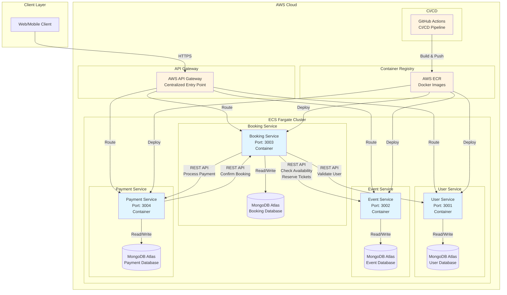

# Event Ticket Booking System - Architecture Diagram

## System Architecture



## Communication Flow

### 1. User Registration/Login Flow
```
Client → API Gateway → User Service → MongoDB Atlas
```

### 2. Event Booking Flow
```
Client → API Gateway → Booking Service
  ↓
Booking Service → User Service (validate user)
  ↓
Booking Service → Event Service (check availability & reserve tickets)
  ↓
Booking Service → Payment Service (process payment)
  ↓
Payment Service → Booking Service (confirm booking)
```

### 3. Service-to-Service Communication

**Booking Service ↔ User Service**
- Booking Service calls User Service to validate user and fetch user details
- Endpoint: `GET /api/users/:userId`
- Authentication: Service token in header `x-service-token`

**Booking Service ↔ Event Service**
- Booking Service calls Event Service to check ticket availability
- Booking Service calls Event Service to reserve tickets
- Booking Service calls Event Service to release tickets (on cancellation)
- Endpoints:
  - `GET /api/events/:eventId/availability`
  - `POST /api/events/:eventId/reserve`
  - `POST /api/events/:eventId/release`
- Authentication: Service token in header `x-service-token`

**Booking Service ↔ Payment Service**
- Booking Service calls Payment Service to initiate payment
- Endpoint: `POST /api/payments/process`
- Authentication: Service token in header `x-service-token`

**Payment Service → Booking Service**
- Payment Service calls Booking Service to confirm booking after successful payment
- Endpoint: `POST /api/bookings/:bookingId/confirm`
- Authentication: Service token in header `x-service-token`

## Infrastructure Components

### AWS Services
- **API Gateway**: Routes external requests to appropriate microservices
- **ECS Fargate**: Serverless container orchestration
- **ECR**: Docker container registry
- **Security Groups**: Network-level security for service communication
- **IAM Roles**: Least privilege access for ECS tasks

### Database
- **MongoDB Atlas**: Managed MongoDB service (free tier)
- Each service has its own database cluster
- IP whitelisting and authentication enabled

### CI/CD
- **GitHub Actions**: Automated build, test, and deployment
- Builds Docker images and pushes to ECR
- Deploys to ECS Fargate automatically

## Security Measures

1. **Service-to-Service Authentication**: Service tokens for inter-service communication
2. **HTTPS**: All communication over TLS
3. **IAM Roles**: Each ECS task has minimal required permissions
4. **Security Groups**: Restrict network traffic between services
5. **MongoDB Atlas Security**: IP whitelisting and database authentication
6. **Environment Variables**: Sensitive configuration stored in ECS task definitions
